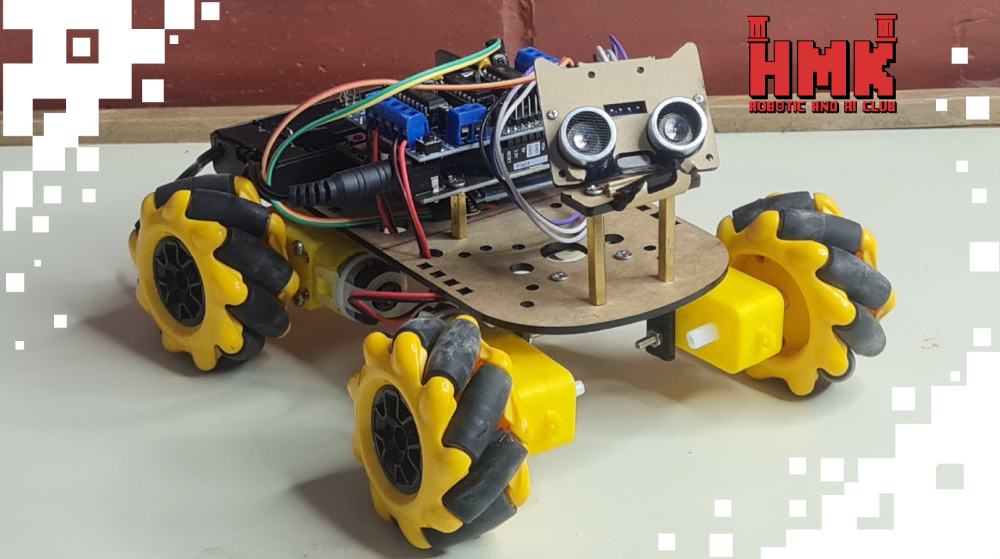

# 🤖 Mecanum Wheels Robot

## 📅 Project Timeline & Context

- **Event:** FMEE 2025 – **AI & Robotics Club** Open Day
- **Date:** November 10–11–12, 2025

---

## 💡 Project Overview

A fully mobile robot built with **ESP32** and **omnidirectional Mecanum wheels**, enabling smooth movement in any direction—forward, sideways, diagonally, and full rotation.  
The robot is controlled through a custom mobile app and equipped with an ultrasonic sensor for basic obstacle awareness.

This project showcases a versatile omnidirectional robot using Mecanum wheels.  
With four independently driven DC motors and ESP32-based wireless control, the robot can perform complex movements that traditional wheel robots cannot.  
A mobile app communicates with the ESP32 over Wi-Fi , allowing users to manually drive the robot or trigger predefined motion patterns.

The ultrasonic sensor adds basic environmental awareness, enabling safer and more interactive motion control.

---

## ⚙️ Components and Parts Used

### 🛠 Hardware
- 🧠 **ESP32** – main controller with Wi-Fi capability  
- 🔧 **4 DC Motors** – one for each Mecanum wheel  
- ⚡ **Motor Driver / Motor Controller** – controls motor speed and direction  
- 📦 **Mecanum Wheels Set** – omnidirectional wheel system  
- 📡 **Ultrasonic Sensor** – distance measurement for obstacle detection  
- 🔋 **Battery Pack / Power Module** – powers motors and ESP32  
- 📱 **Mobile Phone** – robot control interface via mobile app  

---

## 💻 Software and Tools Used
- **Arduino IDE** – programming the ESP32  
- **ESP32 Wi-Fi Communication** – for mobile control  
- **Custom Mobile App** – joystick-based and button-based control  
- **Motor Control Libraries** – handling PWM and directional control  
- **Ultrasonic Sensor Library** – measuring distance and avoiding obstacles  

---

## 👨‍💻 Contributors:

- **Amer Alsaour**  [LinkedIn](https://www.linkedin.com/in/amer-alsaour-026898193/)
- **Ahmad Sheikh Daher** [LinkedIn](https://www.linkedin.com/in/ahmad-sheikh-daher/)  

---

## 🚀 Future Improvements
- Integrate autonomous navigation modes  
- Add SLAM or map-building capabilities  
- Implement object following or obstacle avoidance  
- Create more advanced motion presets in the mobile app  

---

## 📸 Demo

**Coming soon!**

---

**Made with ❤️ using ESP32.**
